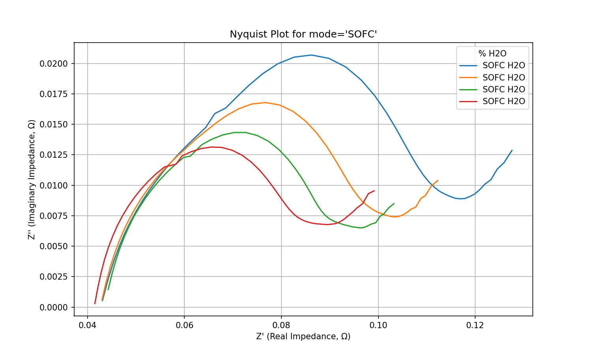

# Advances in Functional Materials Team Report

######         — by [Shymanska Hanna](mailto:a.shymanska.ip13@kpi.ua), [Kyselov Mykyta](mailto:zeusmobilenick@gmail.com), and [Kovalenko Mariia](mailto:ipkovalenkomaria@gmail.com).

## Table of Contents

1. [Introduction](#introduction)
2. [Measurements](#measurements)
    1. [OCV vs. Time](#ocv-vs-time)
    2. [I-V Curves](#i-v-curves)
    3. [P-I Curves](#p-i-curves)
    4. [Nyquist Plots](#nyquist-plots)
3. [How Measurements Were Conducted](#how-measurements-were-conducted)
4. [Results](#results)
    1. [OCV vs Time Curves for SOFC mode](#ocv-vs-time-curves-for-sofc-mode)
    2. [I-V Curves for SOFC/SOEC Modes](#i-v-curves-for-sofcsoec-modes)
    3. [P-I Curves for SOFC Mode](#p-i-curves-for-sofc-mode)
    4. [P-I Curves for SOEC Mode](#p-i-curves-for-soec-mode)
    5. [Nyquist Plots for SOFC Mode](#nyquist-plots-for-sofc-mode)
    6. [Nyquist Plots for SOEC Mode](#nyquist-plots-for-soec-mode)
    7. [SEM Images of SOFC Cross-Section: Before Operation](#sem-images-of-sofc-cross-section-before-operation)
    8. [SEM Images of SOFC Cross-Section: After Operation](#sem-images-of-sofc-cross-section-after-operation)
5. [Observations](#observations)
6. [Conclusions](#conclusions)
7. [License](#license)

## Introduction

This project involves the measurement and analysis of Open Circuit Voltage (OCV) vs. Time, Current-Voltage (I-V) Curves,
Power-Current (P-I) Curves, and Nyquist Plots for both Solid Oxide Fuel Cell (SOFC) and Solid Oxide Electrolysis Cell (
SOEC) modes. The experiments aim to observe the stability, performance, and electrochemical behavior of the cell in
different atmospheres.

## Measurements

### OCV vs. Time

Measurement of the OCV over time to observe the stability and behavior of the cell in different atmospheres.

### I-V Curves

Measurement of voltage as a function of current density to evaluate the cell's performance in both SOFC and SOEC modes.

### P-I Curves

Measurement of power density as a function of current density to assess the power output of the SOFC.

### Nyquist Plots

Measurement of impedance at different frequencies to analyze the electrochemical behavior and internal resistance of the
cell.

## How Measurements Were Conducted

- **OCV Measurement**: The cell was exposed to specific atmospheres, and the OCV was recorded over time to monitor
  stability and potential degradation.
- **I-V and P-I Curves**: The current density was varied while recording the corresponding voltage to generate I-V
  curves. The power density was calculated and plotted against current density to produce P-I curves.
- **Nyquist Plots**: Impedance spectroscopy was conducted by applying an AC signal at various frequencies and recording
  the impedance to form Nyquist plots.

## Results

### OCV vs Time Curves for SOFC mode

Showing OCV stability over time under different atmospheric conditions.

### I-V Curves for SOFC/SOEC Modes

- **SOFC Mode**: Fuel-rich atmosphere, power generation. Higher voltage at low current, indicating efficient operation.
- **SOEC Mode**: Oxidant-rich atmosphere, electrolysis. Higher voltages required for current generation, less efficient.
  Variation in gas composition impacts performance curves. Optimization of operating conditions is crucial.

### P-I Curves for SOFC Mode

Showing power density vs. current density for different percentages of H2O in SOFC mode.

### P-I Curves for SOEC Mode

Showing power density vs. current density for different percentages of H2O in SOEC mode.

### Nyquist Plots for SOFC Mode

Electrochemical Processes: Impedance features correspond to charge transfer, mass transport, and other kinetic
phenomena. Quantify ohmic, activation, and concentration losses within the SOFC. Nyquist plot guides improvements to
materials, microstructure, and operating conditions. Performance Monitoring: Changes in Nyquist plot over time indicate
degradation mechanisms.

### Nyquist Plots for SOEC Mode

### SEM Images of SOFC Cross-Section: Before Operation

- **Anode**: The pre-operation anode images show a porous structure, essential for efficient fuel gas transport within
  the anode.
- **Electrolyte**: Appears dense with minimal porosity, crucial for preventing gas crossover and ensuring good ionic
  conductivity. Exhibits a fine-grained structure, important for its function as a solid-state electrolyte.
- **Cathode**: Displays a distinct bilayer structure. Consists of small grains, which typically provide a high surface
  area for electrochemical reactions.

### SEM Images of SOFC Cross-Section: After Operation

- **Anode**: Both anode versions exhibit heightened porosity, with the initially more porous anode showing dramatic void
  formation.
- **Electrolyte**: Cracks within the electrolyte are concerning, as they can lead to increased resistance and
  detrimental gas crossover, reducing efficiency.
- **Cathode**: The cathode demonstrates greater structural integrity compared to the anode, suggesting better material
  stability under the operating conditions.

## Observations

- Significant increase in anode porosity after operation, especially in the initially more porous version.
- Cracks clear within the electrolyte layer after operation.
- Delamination or gaps observed at both the anode-electrolyte and cathode-electrolyte interfaces.
- Cathode microstructure is relatively well-preserved compared to the significant changes in the anode.
- Slight roughening at the cathode-electrolyte interface.

## Conclusions

Post-operation SEM analysis reveals significant microstructural changes in the SOFC, most notably significant porosity
increases in the anode and the development of cracks in the electrolyte layer. Additionally, delamination at both the
anode-electrolyte and cathode-electrolyte interfaces points to compromise mechanical stability within the SOFC
structure.

## License

The project is licensed under the [CC BY-NC 4.0 License](LICENSE.md).